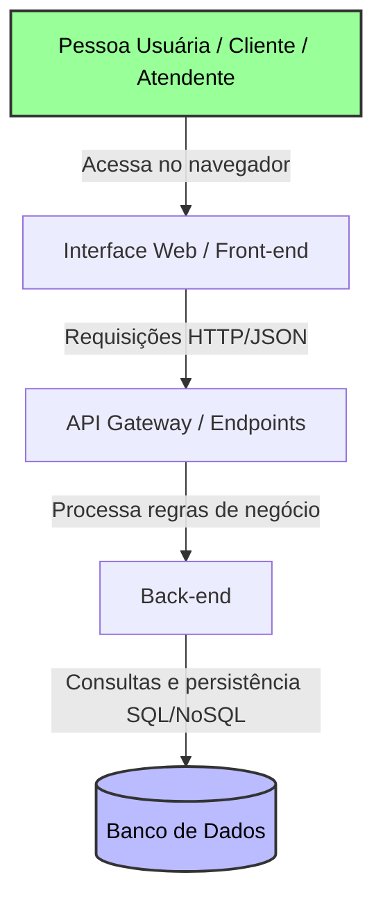

```mermaid
graph TD
    classDef userStyle fill:#9f9,stroke:#333,stroke-width:2px,color:#000;
    classDef dbStyle fill:#bbf,stroke:#333,stroke-width:2px,color:#000;

    A[Pessoa Usuária / Cliente / Atendente]:::userStyle -->|Acessa no navegador| B[Interface Web / Front-end]
    B -->|Requisições HTTP/JSON| C[API Gateway / Endpoints]
    C -->|Processa regras de negócio| D[Back-end]
    D -->|Consultas e persistência SQL/NoSQL| E[(Banco de Dados)]:::dbStyle
```
